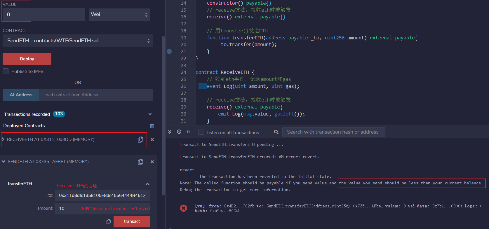
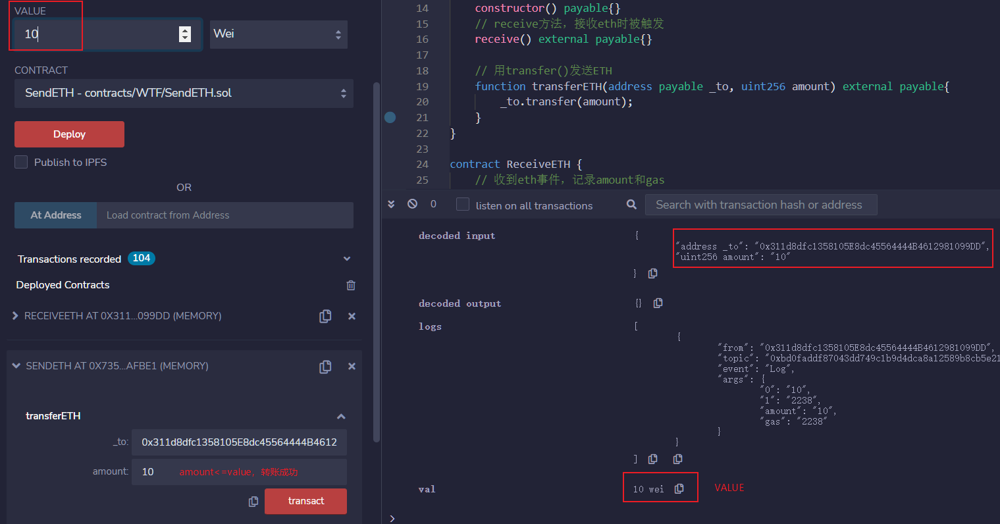
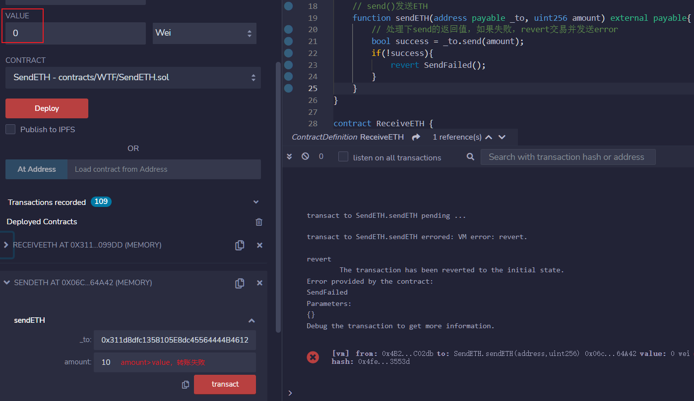
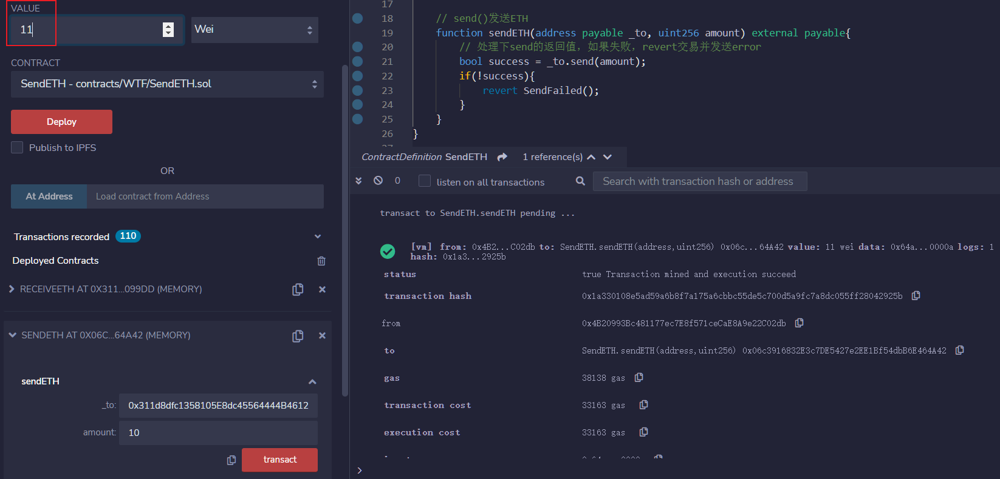
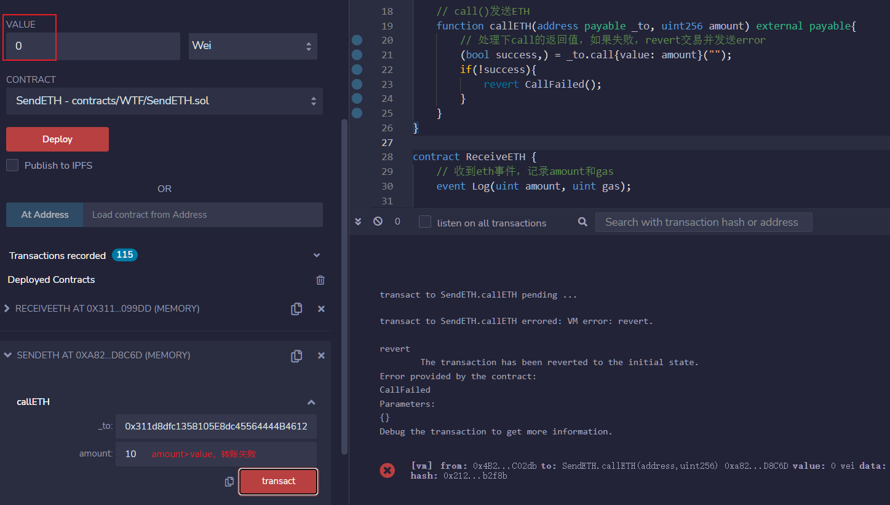

# WTF Solidity极简入门: 20. 发送ETH

<LessonProcess meta={require('./meta.json')} />

我最近在重新学 Solidity，巩固一下细节，也写一个“WTF Solidity极简入门”，供小白们使用（编程大佬可以另找教程），每周更新 1-3 讲。

推特：[@0xAA_Science](https://twitter.com/0xAA_Science)｜[@WTFAcademy_](https://twitter.com/WTFAcademy_)

社区：[Discord](https://discord.gg/5akcruXrsk)｜[微信群](https://docs.google.com/forms/d/e/1FAIpQLSe4KGT8Sh6sJ7hedQRuIYirOoZK_85miz3dw7vA1-YjodgJ-A/viewform?usp=sf_link)｜[官网 wtf.academy](https://wtf.academy)

所有代码和教程开源在 github: [github.com/AmazingAng/WTF-Solidity](https://github.com/AmazingAng/WTF-Solidity)

---
`Solidity`有三种方法向其他合约发送`ETH`，他们是：`transfer()`，`send()`和`call()`，其中`call()`是被鼓励的用法。

## 接收ETH合约

我们先部署一个接收`ETH`合约`ReceiveETH`。`ReceiveETH`合约里有一个事件`Log`，记录收到的`ETH`数量和`gas`剩余。还有两个函数，一个是`receive()`函数，收到`ETH`被触发，并发送`Log`事件；另一个是查询合约`ETH`余额的`getBalance()`函数。

```solidity
contract ReceiveETH {
    // 收到eth事件，记录amount和gas
    event Log(uint amount, uint gas);
    
    // receive方法，接收eth时被触发
    receive() external payable{
        emit Log(msg.value, gasleft());
    }
    
    // 返回合约ETH余额
    function getBalance() view public returns(uint) {
        return address(this).balance;
    }
}
```

部署`ReceiveETH`合约后，运行`getBalance()`函数，可以看到当前合约的`ETH`余额为`0`。


## 发送ETH合约

我们将实现三种方法向`ReceiveETH`合约发送`ETH`。首先，先在发送ETH合约`SendETH`中实现`payable`的`构造函数`和`receive()`，让我们能够在部署时和部署后向合约转账。

```solidity
contract SendETH {
    // 构造函数，payable使得部署的时候可以转eth进去
    constructor() payable{}
    // receive方法，接收eth时被触发
    receive() external payable{}
}
```

### transfer

- 用法是`接收方地址.transfer(发送ETH数额)`。
- `transfer()`的`gas`限制是`2300`，足够用于转账，但对方合约的`fallback()`或`receive()`函数不能实现太复杂的逻辑。
- `transfer()`如果转账失败，会自动`revert`（回滚交易）。

代码样例，注意里面的`_to`填`ReceiveETH`合约的地址，`amount`是`ETH`转账金额：

```solidity
// 用transfer()发送ETH
function transferETH(address payable _to, uint256 amount) external payable{
    _to.transfer(amount);
}
```

部署`SendETH`合约后，对`ReceiveETH`合约发送ETH，此时`amount`为10，`value`为0，`amount`>`value`，转账失败，发生`revert`。



此时`amount`为10，`value`为10，`amount`<=`value`，转账成功。



在`ReceiveETH`合约中，运行`getBalance()`函数，可以看到当前合约的`ETH`余额为`10`。


### send

- 用法是`接收方地址.send(发送ETH数额)`。
- `send()`的`gas`限制是`2300`，足够用于转账，但对方合约的`fallback()`或`receive()`函数不能实现太复杂的逻辑。
- `send()`如果转账失败，不会`revert`。
- `send()`的返回值是`bool`，代表着转账成功或失败，需要额外代码处理一下。

代码样例：

```solidity
error SendFailed(); // 用send发送ETH失败error

// send()发送ETH
function sendETH(address payable _to, uint256 amount) external payable{
    // 处理下send的返回值，如果失败，revert交易并发送error
    bool success = _to.send(amount);
    if(!success){
        revert SendFailed();
    }
}
```

对`ReceiveETH`合约发送ETH，此时`amount`为10，`value`为0，`amount`>`value`，转账失败，因为经过处理，所以发生`revert`。



此时`amount`为10，`value`为11，`amount`<=`value`，转账成功。



### call

- 用法是`接收方地址.call{value: 发送ETH数额}("")`。
- `call()`没有`gas`限制，可以支持对方合约`fallback()`或`receive()`函数实现复杂逻辑。
- `call()`如果转账失败，不会`revert`。
- `call()`的返回值是`(bool, bytes)`，其中`bool`代表着转账成功或失败，需要额外代码处理一下。

代码样例：

```solidity
error CallFailed(); // 用call发送ETH失败error

// call()发送ETH
function callETH(address payable _to, uint256 amount) external payable{
    // 处理下call的返回值，如果失败，revert交易并发送error
    (bool success,) = _to.call{value: amount}("");
    if(!success){
        revert CallFailed();
    }
}
```

对`ReceiveETH`合约发送ETH，此时`amount`为10，`value`为0，`amount`>`value`，转账失败，因为经过处理，所以发生`revert`。



此时`amount`为10，`value`为11，`amount`<=`value`，转账成功。


运行三种方法，可以看到，他们都可以成功地向`ReceiveETH`合约发送`ETH`。

## 总结

这一讲，我们介绍`Solidity`三种发送`ETH`的方法：`transfer`，`send`和`call`。

- `call`没有`gas`限制，最为灵活，是最提倡的方法；
- `transfer`有`2300 gas`限制，但是发送失败会自动`revert`交易，是次优选择；
- `send`有`2300 gas`限制，而且发送失败不会自动`revert`交易，几乎没有人用它。

<LessonQuizStart meta={require('./meta.json')} />