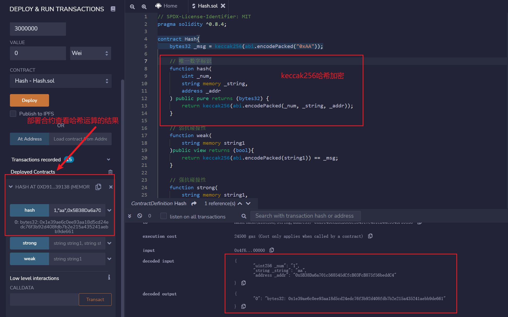
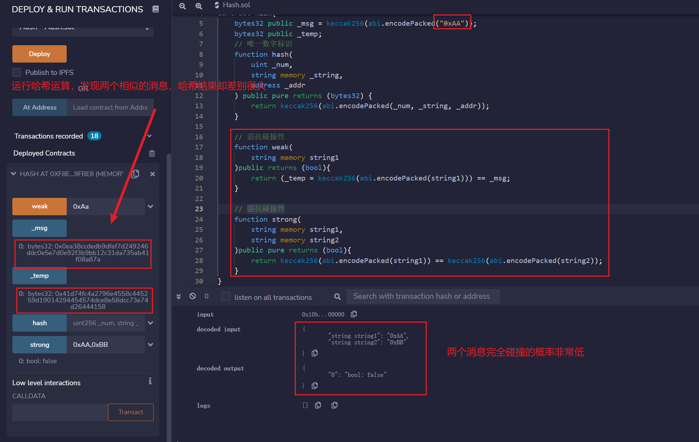

# WTF Solidity极简入门: 28. Hash

<LessonProcess meta={require('./meta.json')} />

我最近在重新学 Solidity，巩固一下细节，也写一个“WTF Solidity极简入门”，供小白们使用（编程大佬可以另找教程），每周更新 1-3 讲。

推特：[@0xAA_Science](https://twitter.com/0xAA_Science)｜[@WTFAcademy_](https://twitter.com/WTFAcademy_)

社区：[Discord](https://discord.gg/5akcruXrsk)｜[微信群](https://docs.google.com/forms/d/e/1FAIpQLSe4KGT8Sh6sJ7hedQRuIYirOoZK_85miz3dw7vA1-YjodgJ-A/viewform?usp=sf_link)｜[官网 wtf.academy](https://wtf.academy)

所有代码和教程开源在 github: [github.com/AmazingAng/WTF-Solidity](https://github.com/AmazingAng/WTF-Solidity)

---

哈希函数（hash function）是一个密码学概念，它可以将任意长度的消息转换为一个固定长度的值，这个值也称作哈希（hash）。这一讲，我们简单介绍一下哈希函数及在`Solidity`的应用。

## Hash的性质

一个好的哈希函数应该具有以下几个特性：

- 单向性：从输入的消息到它的哈希的正向运算简单且唯一确定，而反过来非常难，只能靠暴力枚举。
- 灵敏性：输入的消息改变一点对它的哈希改变很大。
- 高效性：从输入的消息到哈希的运算高效。
- 均一性：每个哈希值被取到的概率应该基本相等。
- 抗碰撞性：
  - 弱抗碰撞性：给定一个消息`x`，找到另一个消息`x'`，使得`hash(x) = hash(x')`是困难的。
  - 强抗碰撞性：找到任意`x`和`x'`，使得`hash(x) = hash(x')`是困难的。

## Hash的应用

- 生成数据唯一标识
- 加密签名
- 安全加密

## Keccak256

`Keccak256`函数是`Solidity`中最常用的哈希函数，用法非常简单：

```solidity
哈希 = keccak256(数据);
```

### Keccak256和sha3

这是一个很有趣的事情：

1. sha3由keccak标准化而来，在很多场合下Keccak和SHA3是同义词，但在2015年8月SHA3最终完成标准化时，NIST调整了填充算法。**所以SHA3就和keccak计算的结果不一样**，这点在实际开发中要注意。
2. 以太坊在开发的时候sha3还在标准化中，所以采用了keccak，所以Ethereum和Solidity智能合约代码中的SHA3是指Keccak256，而不是标准的NIST-SHA3，为了避免混淆，直接在合约代码中写成Keccak256是最清晰的。

### 生成数据唯一标识

我们可以利用`keccak256`来生成一些数据的唯一标识。比如我们有几个不同类型的数据：`uint`，`string`，`address`，我们可以先用`abi.encodePacked`方法将他们打包编码，然后再用`keccak256`来生成唯一标识：

```solidity
function hash(
    uint _num,
    string memory _string,
    address _addr
    ) public pure returns (bytes32) {
    return keccak256(abi.encodePacked(_num, _string, _addr));
}
```

### 弱抗碰撞性

我们用`keccak256`演示一下之前讲到的弱抗碰撞性，即给定一个消息`x`，找到另一个消息`x'`，使得`hash(x) = hash(x')`是困难的。

我们给定一个消息`0xAA`，试图去找另一个消息，使得它们的哈希值相等：

```solidity
// 弱抗碰撞性
function weak(
    string memory string1
    )public view returns (bool){
    return keccak256(abi.encodePacked(string1)) == _msg;
}
```

大家可以试个10次，看看能不能幸运的碰撞上。

### 强抗碰撞性

我们用`keccak256`演示一下之前讲到的强抗碰撞性，即找到任意不同的`x`和`x'`，使得`hash(x) = hash(x')`是困难的。

我们构造一个函数`strong`，接收两个不同的`string`参数`string1`和`string2`，然后判断它们的哈希是否相同：

```solidity
// 强抗碰撞性
function strong(
        string memory string1,
        string memory string2
    )public pure returns (bool){
    return keccak256(abi.encodePacked(string1)) == keccak256(abi.encodePacked(string2));
}
```

大家可以试个10次，看看能不能幸运的碰撞上。

## 在remix上验证

- 部署合约查看唯一标识的生成结果

    

- 验证哈希函数的灵敏性，以及强、弱抗碰撞性

    

## 总结

这一讲，我们介绍了什么是哈希函数，以及如何使用`Solidity`最常用的哈希函数`keccak256`。

<LessonQuizStart meta={require('./meta.json')} />